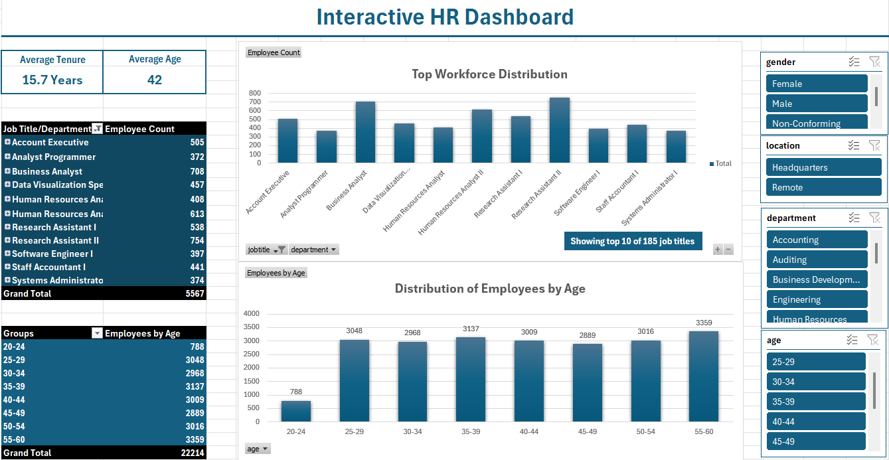

# hr-analytics-dashboard-excel

## Interactive HR Analytics Dashboard | Excel
## Goal
To analyze employee data and uncover insights about workforce distribution, age demographics, tenure, and organizational structure through an interactive Excel dashboard.
## Description
This project analyzes a human resources dataset of 22,214 employees containing information such as job title, department, age, gender, location, hire date, and termination date. The objective is to understand workforce composition and identify key HR metrics that support people analytics and decision making.
The project includes the following steps: data loading, data cleaning and preprocessing, pivot table creation, and interactive dashboard development in Excel.

## Dashboard

## Data Cleaning Steps

* Removed 224 blank rows with missing employee records
* Validated age ranges and employee counts across departments
* Handled missing termination dates (blank = currently active employee)

## Dashboard Features

* KPI cards showing Average Tenure (15.7 years) and Average Age (42)
* Top 10 job titles by employee count with note showing total job titles (185)
* Employee age distribution across 8 age groups (20–60)
* Interactive slicers to filter by gender, location, department, and age group

## Key Insights

* The workforce is evenly distributed across age groups from 25 to 60
* The youngest age group (20–24) has significantly fewer employees at 788
* Research Assistant II and Business Analyst are the most common job titles
* Average employee tenure is 15.7 years indicating high retention
* Workforce is split between Headquarters and Remote locations

## Skills
Data cleaning, exploratory data analysis (EDA), pivot tables, data visualization, dashboard development, HR data analysis

## Tools 
* Microsoft Excel 
* Pivot Tables
* Slicers

## Key Learnings
This project strengthened my ability to work with large HR datasets, build interactive dashboards using pivot tables and slicers, and present workforce insights in a clear and accessible way for non-technical audiences.
